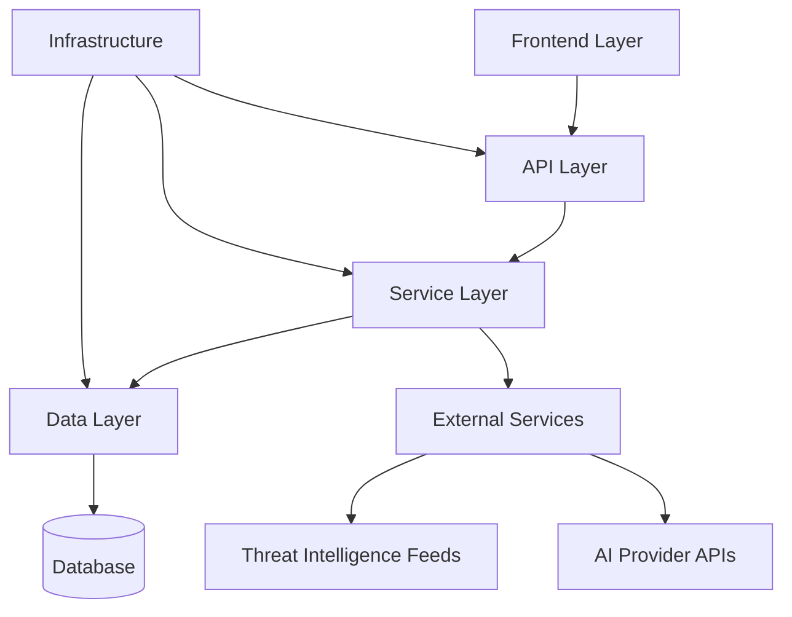
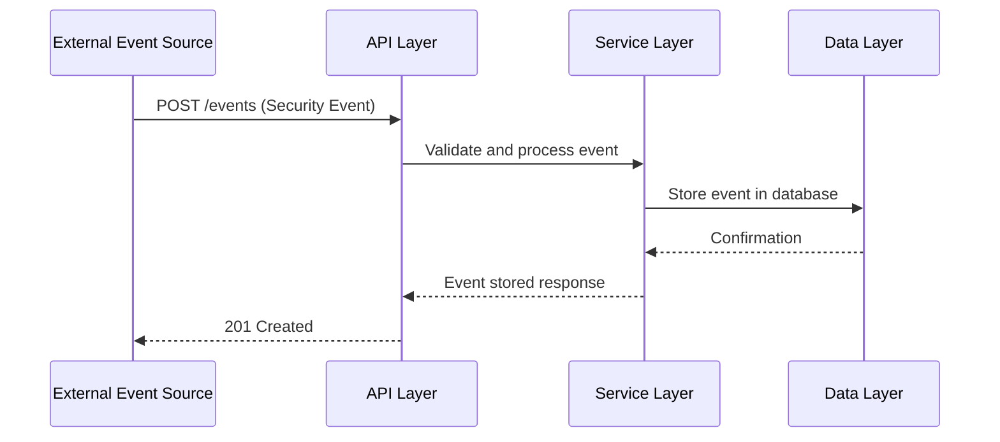
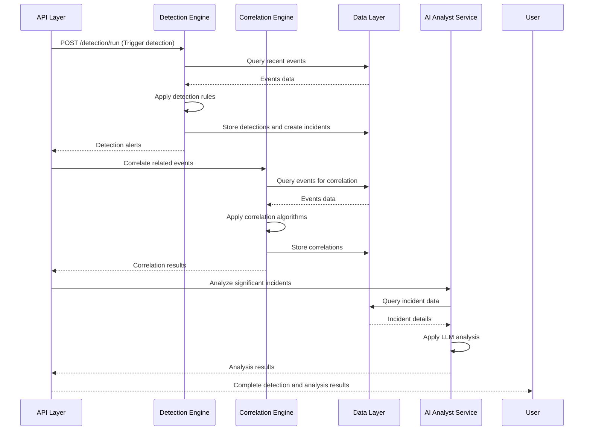
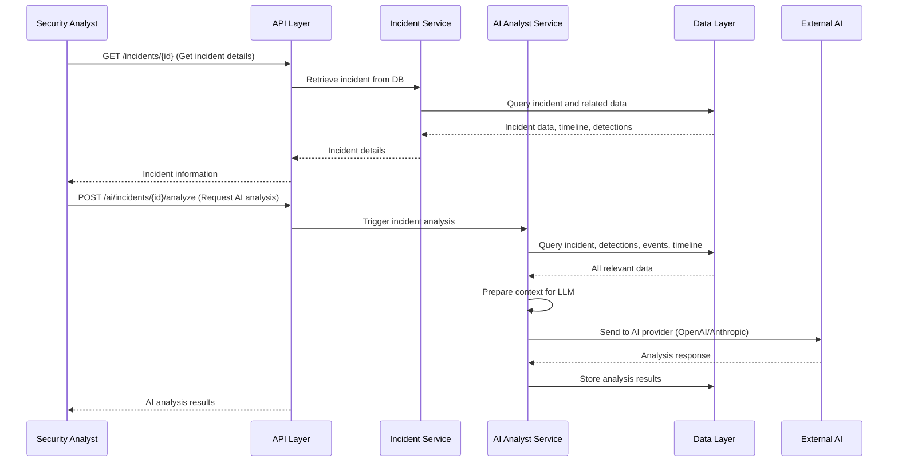
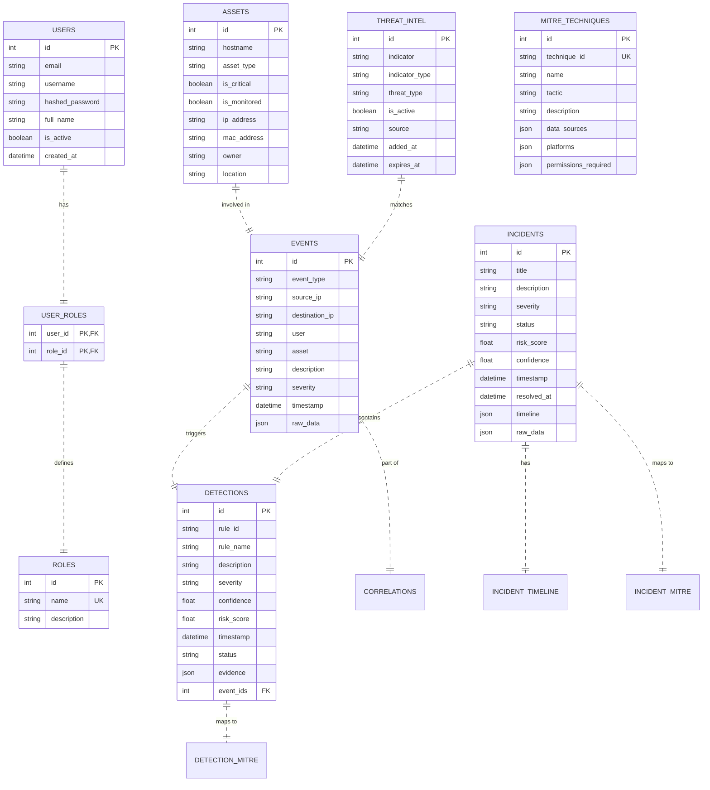
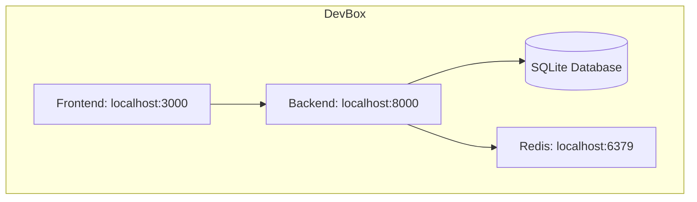
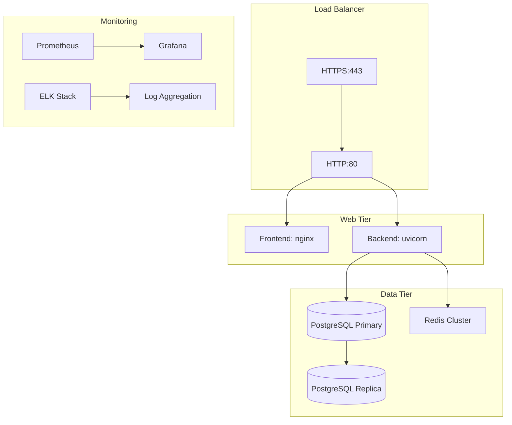
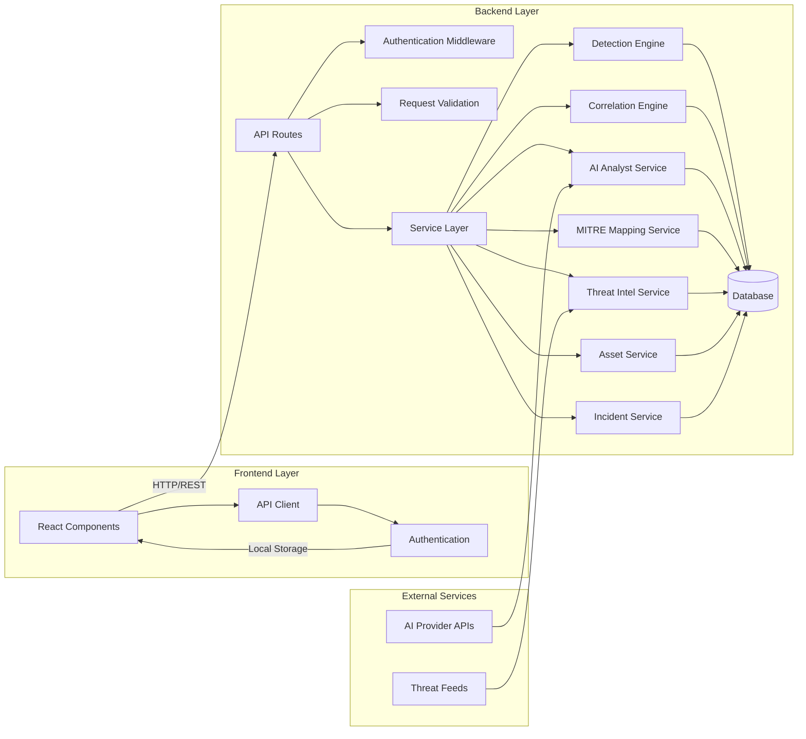
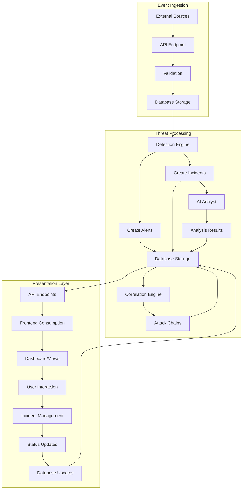

# AegisSOC Architecture

This document describes the technical architecture of the AegisSOC platform, detailing the components, their interactions, and the data flow through the system.

## Overview

AegisSOC follows a layered architecture pattern separating concerns between presentation, API, business logic, and data layers. The system is designed to be modular, scalable, and maintainable.

## Layer Breakdown

### 1. Frontend Layer

**Technology**: Next.js 14 (App Router), TypeScript, Tailwind CSS, shadcn/ui

**Components**:
- **Pages**: Route-based components for different views (dashboard, incidents, etc.)
- **Components**: Reusable UI components (tables, forms, charts, modals)
- **Libraries**: API client, authentication utilities, helper functions
- **Styles**: Global CSS and Tailwind configuration

**Responsibilities**:
- User interface rendering
- Client-state management
- API communication
- User authentication handling
- Responsive design for various screen sizes

**Key Files**:
- `frontend/src/app/` - Page components and routing
- `frontend/src/components/` - Reusable UI components
- `frontend/src/lib/api.ts` - API client and auth utilities

### 2. API Layer

**Technology**: FastAPI (Python 3.11)

**Components**:
- **API Routers**: Route definition and request/response validation
- **Endpoints**: CRUD operations and business logic endpoints
- **Middleware**: Security headers, CORS, rate limiting
- **Dependencies**: Database sessions, authentication, validation

**Responsibilities**:
- HTTP request handling
- Request validation and sanitization
- Authentication and authorization
- Response formatting
- API documentation generation (OpenAPI/Swagger)

**Key Files**:
- `backend/app/main.py` - Application setup and middleware
- `backend/app/api/` - API routers and endpoint definitions
- `backend/app/core/` - Configuration, security, dependencies

### 3. Service Layer

**Technology**: Python 3.11

**Components**:
- **Detection Engine**: Rule-based threat detection
- **Correlation Engine**: Event correlation and attack chain identification
- **AI Analyst Service**: LLM-powered incident investigation
- **MITRE Mapping Service**: Technique mapping and enrichment
- **Threat Intelligence Service**: IOC enrichment and lookup
- **Asset Service**: Asset management operations
- **Incident Service**: Incident lifecycle management

**Responsibilities**:
- Business logic implementation
- Data processing and transformation
- External service integration
- Complex algorithm implementation
- Service coordination

**Key Files**:
- `backend/app/services/` - All service implementations
- `backend/app/models/` - SQLAlchemy ORM models

### 4. Data Layer

**Technology**: SQLAlchemy ORM, PostgreSQL/SQLite

**Components**:
- **Models**: Database table definitions and relationships
- **Session Management**: Database connection handling
- **Migrations**: Schema version control (Alembic)

**Responsibilities**:
- Data persistence
- Data retrieval and querying
- Transaction management
- Data integrity enforcement
- Relationship management

**Key Files**:
- `backend/app/models/` - Database models
- `backend/app/db/` - Database session and connection
- `backend/alembic/` - Migration scripts

### 5. Infrastructure Layer

**Components**:
- **Containerization**: Docker and Docker Compose
- **Caching**: Redis for temporary data storage
- **Server**: Uvicorn ASGI server for production
- **CI/CD**: GitHub Actions for automated testing and deployment
- **Monitoring**: Health checks, logging, error tracking

**Responsibilities**:
- Environment consistency
- Horizontal scaling facilitation
- Dependency management
- Deployment automation
- Observability and monitoring

## Data Flow

### Event Ingestion Flow

### Detection Flow

### Incident Investigation Flow

## Security Architecture

### Authentication & Authorization

```mermaid
graph LR
    A[User Login] --> B[Auth Endpoint]
    B --> C[Validate Credentials]
    C --> D[Generate JWT]
    D --> E[Return Token]
    E --> F[Store Token Client-side]
    F --> G[Include Token in Requests]
    G --> H[Verify Token Middleware]
    H --> I[Check Permissions]
    I --> J[Allow/Deny Request]
```

**Security Features**:
- Password hashing using bcrypt
- JWT-based authentication with expiration
- Role-based access control (ADMIN, SECURITY_ANALYST, VIEWER)
- OAuth2PasswordRequestForm for login
- Environment-based secret management
- Security headers (CSP, X-Frame-Options, etc.)
- Rate limiting on sensitive endpoints
- Input validation and sanitization
- SQL injection prevention via ORM

### Data Protection
- Environment variables for sensitive configuration
- No logging of sensitive data
- Secure password storage
- HTTPS recommended for production (TLS termination at reverse proxy)
- Database connection security

## Component Details

### Detection Engine

**Location**: `backend/app/services/detection_engine.py`

**Capabilities**:
- Brute force detection (multiple failed login attempts)
- Port scan detection (multiple port connections from single IP)
- Privilege escalation detection (suspicious privilege changes)
- Rule-based detection framework
- MITRE ATT&CK technique mapping
- Confidence scoring and risk assessment

**Data Flow**:
1. Receive events from database
2. Apply detection rules to event streams
3. Generate alerts with risk scores and evidence
4. Create detection records in database
5. Automatically create incidents for high-confidence detections
6. Link detections to MITRE techniques

### Correlation Engine

**Location**: `backend/app/services/correlation_engine.py`

**Capabilities**:
- Temporal correlation (events within time windows)
- Entity-based correlation (same IP, user, asset)
- Attack chain reconstruction
- Severity propagation and escalation
- Configurable correlation windows

**Data Flow**:
1. Query events based on time windows or filters
2. Group events by common attributes (IP, user, asset, etc.)
3. Apply temporal and logical correlation rules
4. Generate correlation records representing attack chains
5. Calculate aggregate severity and confidence
6. Store correlation results for API retrieval

### AI Analyst Service

**Location**: `backend/app/services/ai_analyst.py`

**Capabilities**:
- Incident root cause analysis
- Attack timeline reconstruction
- Impact assessment and scoping
- Remediation recommendations
- Threat hunting query assistance
- MITRE technique attribution

**Data Flow**:
1. Receive incident ID for analysis
2. Query comprehensive incident data (events, detections, timeline)
3. Prepare structured prompt for LLM
4. Send to configured AI provider (OpenAI, Anthropic, etc.)
5. Parse and structure AI response
6. Store analysis results in database
7. Return formatted analysis to API

### MITRE Mapping Service

**Location**: `backend/app/services/mitre_mapping.py`

**Capabilities**:
- Technique lookup by ID or name
- Tactic-based filtering
- Detection rule to technique mapping
- Technique relationship traversal
- ATT&CK framework version management

**Data Flow**:
1. Receive technique ID or detection rule ID
2. Query MITRE techniques table
3. For detection rules, apply predefined mappings
4. Return technique details with tactics and descriptions
5. Cache frequently accessed techniques

### Threat Intelligence Service

**Location**: `backend/app/services/threat_intel.py` (implicit in models)

**Capabilities**:
- IOC (Indicator of Compromise) storage and lookup
- Threat feed integration framework
- Indicator type classification (IP, domain, hash, etc.)
- Active/inactive threat status
- Threat actor attribution

**Data Flow**:
1. Receive threat indicators via API or feeds
2. Store in threat_intel table with metadata
3. Provide lookup capabilities for event enrichment
4. Support for bulk indicator matching
5. Automatic expiration of outdated indicators

## Database Schema

### Core Tables

## External Integrations

### AI Providers
- **OpenAI**: GPT-3.5-turbo, GPT-4 models
- **Anthropic**: Claude models
- **Configured via**: `AI_PROVIDER` and `AI_API_KEY` environment variables

### Threat Intelligence Sources
- Manual API entry (current implementation)
- Planned: Automated feeds from OTX, AlienVault, VirusTotal, etc.
- Format: STIX/TAXII or custom JSON

### Deployment Targets
- **Development**: SQLite database, local Docker compose
- **Production**: PostgreSQL database, Docker compose with nginx reverse proxy
- **Cloud**: AWS ECS, Azure Container Instances, Google Cloud Run

## Communication Protocols

### Internal Communication
- **HTTP/REST**: Between frontend and backend API
- **Direct Method Calls**: Between API layer and service layer
- **Database Queries**: Between service layer and data layer

### External Communication
- **HTTPS/REST**: AI provider APIs (OpenAI, Anthropic)
- **HTTPS/REST**: Threat intelligence feeds (when implemented)
- **Database Protocols**: PostgreSQL/SQLite native protocols

## Performance Characteristics

### Latency Targets
- API Response Time: <200ms for 95% of requests
- Detection Engine: <5s for batch processing
- Correlation Engine: <10s for historical analysis
- AI Analysis: <30s per incident (dependent on provider)

### Throughput
- Event Ingestion: 1000+ events/second (hardware dependent)
- Concurrent Users: 50+ simultaneous analysts
- API Requests: 100+ requests/second

### Scaling Strategies
- **Horizontal**: Multiple API instances behind load balancer
- **Database**: Read replicas for query-heavy operations
- **Caching**: Redis for frequently accessed data
- **Async Processing**: Background workers for non-time-critical tasks

## Deployment Architecture

### Development Environment

### Production Environment

## Extensibility Points

### Adding New Detection Rules
1. Implement detection function in `detection_engine.py`
2. Add rule to detection rule list
3. Define MITRE technique mapping
4. Add unit tests
5. No API changes required

### Adding New Service Endpoints
1. Create new router in `backend/app/api/v1/endpoints/`
2. Implement business logic in service layer
3. Define Pydantic models for request/response
4. Add router to main API router
5. Update OpenAPI documentation automatically

### Adding New Frontend Pages
1. Create new directory in `frontend/src/app/`
2. Add `page.tsx` and optional component files
3. Use existing API client for backend communication
4. Implement UI using shadcn/ui components
5. Add to navigation if appropriate

### Adding New Database Entities
1. Create SQLAlchemy model in `backend/app/models/`
2. Generate migration with Alembic
3. Implement CRUD operations in service layer
4. Create API endpoints in API layer
5. Add frontend components as needed

## Diagrams and Visual References

### Component Interaction Diagram

### Data Flow Diagram

## Conclusion

AegisSOC provides a robust, modular architecture that separates concerns while maintaining tight integration between components. The layered approach enables independent development, testing, and scaling of each layer. The use of modern technologies (FastAPI, Next.js, Docker) ensures the platform is maintainable and deployable across various environments.

The system is designed with extensibility in mind, allowing for easy addition of new detection rules, threat intelligence sources, and analytical capabilities. Security is built into every layer, from authentication and authorization to data protection and secure communication channels.

This architecture supports the core mission of AegisSOC: to provide security teams with actionable intelligence through automated detection, correlation, and AI-powered analysis, enabling faster and more effective incident response.